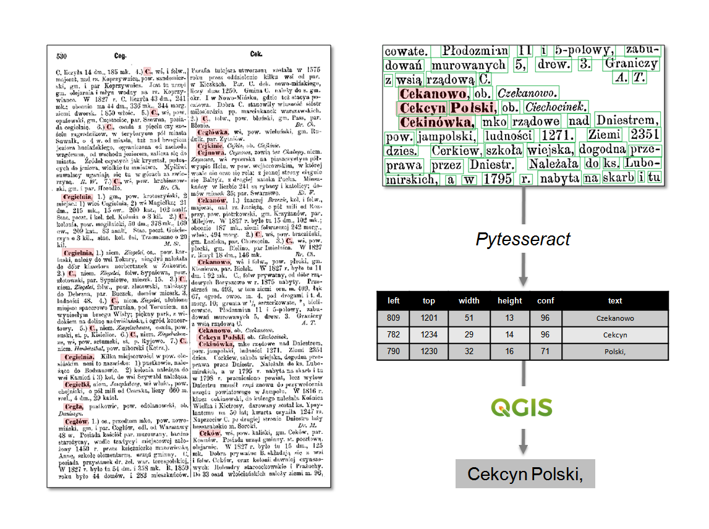
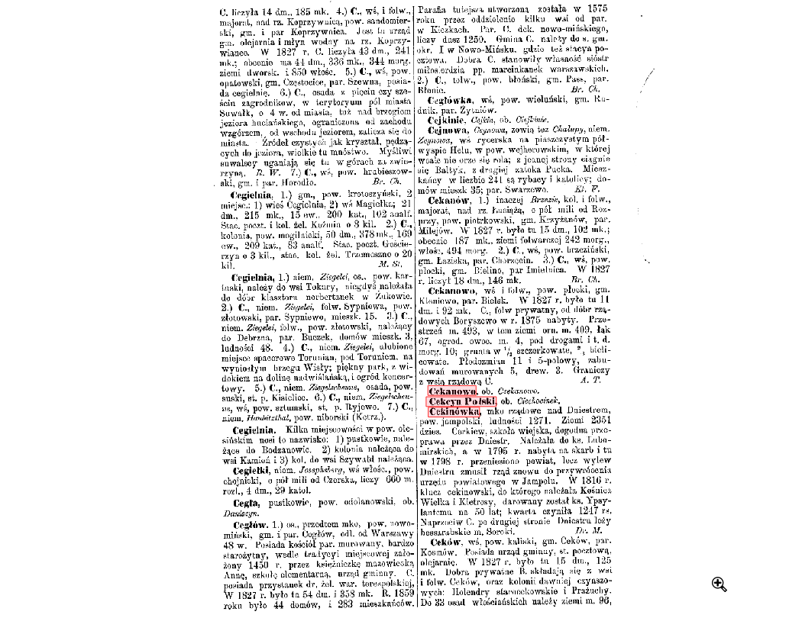
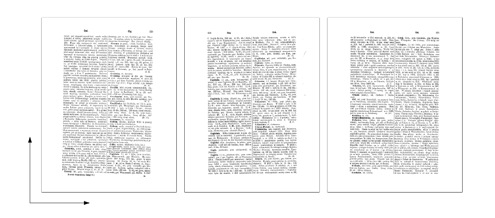

# PW_OCR_ADVENCED


QGIS processing algorithm which recognizes text from raster images inside input polygon features and saves as attribute value of output layer.

PW_OCR_ADVENCED script processes in different way than [*PW_OCR*](https://github.com/OskarGraszka/PW_OCR). Check specifications of both scripts to choose better one for your applications.

## Python Tesseract
PW_OCR script usues [*Pytesseract*](https://github.com/madmaze/pytesseract) library and requires its installation.
After installation you have to update path to your *Tesseract* directory at the beginning of the script.
```Python
// path to your tesseract installation directory.
pytesseract.pytesseract.tesseract_cmd = 'C:\\Program Files\\Tesseract-OCR\\tesseract.exe'
```
You may set *Pytesseract* configuration (page segmentation mode and OCR engine model) using comboboxes of script graphical interface, but if you want to use language other than polish, you have to edit line below in the code:
```Python
data = pytesseract.image_to_data(Raster_lyr.source(), lang='pol', config=self.config, output_type=Output.DICT)
```

## Algorithm




This algorithm iterates over all input raster layers and processes them according to the scheme below:
- Regonizing all words on the sheet and returning table with their pixel coordinates , width, height, confidence of recognition and recognizd text (*Pytesseract* library).
- Itarating over all features overlaying raster and collecting all words which centroids are inside feature boundaries.
- Merging sentences from all collected for each feature words.
- Adding recognized text (sentence) as attribute value to output feature field.

#

#

## Restrictions

This script works properly only if edges of rectified rasters are paralell to exes of QGIS project coordinate reference system.



## Parameters
<dd>
<b>Input polygon layer</b>
<dd>The features used to recognize text inside them.</dd> 
<br><b>Text output field</b>
<dd>The field in the input table in which the recognized text will be add.</dd>
<br><b>Confidence output field</b>
<dd>The field in the input table in which the text recognition confidence will be add. Confidence is saved in the list; one value for each word.</dd>
<br><b>Run for all raster layers</b>
<dd>The algorithm will recognize text from all active raster layers, if checked.</dd> 
<br><b>Input raster layer</b>
<dd>If above checkbox unchecked, the algorithm will recognize text only from this raster layer.
<br>In case of multiband raster images, the only first band will be used.</dd> 
<br><b>Page Segmentation Mode</b>
<dd><i>Tesseract</i> Page Segmentation Mode.</dd> 
<br><b>OCR Engine Model</b>
<dd><i>Tesseract</i> OCR Engine Model.</dd> 
<br><b>Add words recognized with zero confidence</b>
<dd>If there are some words recognized with zero confidence, they will be add too.</dd> 
<br><b>Output layer</b>
<dd>Location of the output layer with filled text attribute.</dd> 
